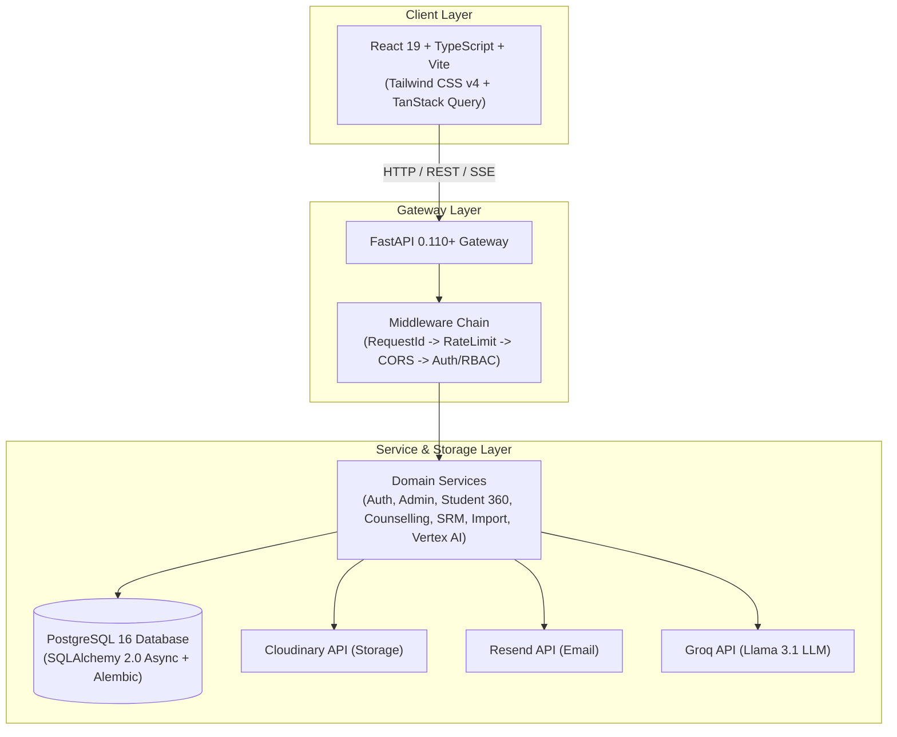

# Student Counselling Management System (SCMS) — Enterprise ERP

<p align="center">
  <b>An Institutional SaaS ERP & Student Relationship Management (SRM) Platform</b><br/>
  <i>Engineered with Clean Architecture, FastAPI, React 19, Vite, and PostgreSQL.</i>
</p>

<p align="center">
  <a href="#-documentation-hub"></a>
  <a href="LICENSE"></a>
  <a href="https://python.org"></a>
  <a href="https://fastapi.tiangolo.com"></a>
  <a href="https://react.dev"></a>
  <a href="https://vitejs.dev"></a>
  <a href="https://www.postgresql.org"></a>
  <a href="https://www.docker.com"></a>
</p>

---

## 📌 Quick Links

- [🚀 Quick Start Guide](#-quick-start)
- [🌐 Live Deployment](#-live-deployment)
- [📖 Documentation Hub](#-documentation-hub)
- [🏢 System Architecture](#-architecture-overview)
- [🛠️ Tech Stack](#%EF%B8%8F-technology-stack)
- [🤝 Contributing Guidelines](docs/Contributing.md)

---

## 💡 Project Overview

### Problem Statement
Higher education institutions routinely manage student mentorship, academic counselling, attendance defaulters, and placement readiness using physical paper registers and unencrypted spreadsheets. This leads to lost historical notes during counsellor changes, delayed interventions for at-risk students, and significant compliance deficits during institutional accreditation audits.

### Enterprise Solution
SCMS is a closed institutional SaaS platform built around Clean Architecture, Event-Driven Domain Notifications, and Role-Based Access Control (RBAC). It unifies Students, Counsellors, Department Heads (HODs), Faculty, and Administrators into role-specific workspaces:

- **Student 360° Workspace**: Consolidated profile combining academic history, attendance metrics, counselling summaries, document vaults, and placement milestones.
- **Counsellor Caseload Hub**: High-touch workspace featuring risk-level indicators, session scheduling, follow-up trackers, and pre-meeting AI briefings.
- **Reach Out (SRM) Hub**: Multi-counsellor department topology, student appointment booking, campus emergency hotlines, and real-time communication timeline logging.
- **Office Import Engine**: Automated 5-step Excel/CSV ingestion pipeline that parses college spreadsheets, validates roll numbers, creates accounts, issues credentials, and exports PDF audit reports.
- **Vertex AI Engine**: Integrated SSE streaming assistant with intent classification, multi-tool orchestration, response evaluation, guardrails, and dynamic UI action triggers — powered by Groq (Llama 3.1).

---

## ✨ Feature Highlights

| Domain | Key Capabilities | Docs |
| :--- | :--- | :--- |
| **🎓 Student 360** | Academic transcripts, SGPA/CGPA calculations, backlog tracking, self-service profile management (12 sections: certifications, skills, internships, publications, clubs, competitions, interviews, achievements), document vault, and academic correction workspace. | [`docs/Architecture.md`](docs/Architecture.md) |
| **👨‍🏫 Counsellor Desk** | Caseload filtering, attention-required dashboard, append-only session logging, confidential notes, follow-up tracker, and SRM timeline logging. | [`docs/Authentication.md`](docs/Authentication.md) |
| **🏢 HOD Supervision** | Department-wide counsellor caseload monitoring, attendance compliance stats, and section academic breakdown. | [`docs/Architecture.md`](docs/Architecture.md) |
| **🛠️ Admin Workspace** | Department & academic year hierarchy configuration, user provisioning, session revocation, office import wizard, and audit log viewer. | [`docs/security.md`](docs/security.md) |
| **🤖 Vertex AI Engine** | SSE streaming LLM assistant (`/api/vertex/message`), intent classification, goal-oriented planning, multi-tool orchestration (profile lookup, records, corrections, UI actions), response evaluation & guardrails, ownership-scoped data access. | [`docs/api.md`](docs/api.md) |
| **📥 Office Import** | 5-step spreadsheet ingestion pipeline (Analyze → Preview → Configure → Execute → Export Credentials & PDF Audit Reports). Supports `.xlsx` and legacy `.xls` formats. | [`docs/api.md`](docs/api.md) |
| **📞 Reach Out (SRM)** | Department multi-counsellor assignments, student appointment booking, emergency contact hotlines, communication health index, parent engagement scores, and channel policy controls. | [`docs/database.md`](docs/database.md) |

---

## 🌐 Live Deployment

The application is deployed and accessible at:

| Component | Platform | URL |
| :--- | :--- | :--- |
| **Frontend** | Vercel | Production SPA with API proxy rewrites |
| **Backend API** | Render | `https://vertex-erp-backend.onrender.com` |
| **Database** | Neon PostgreSQL | Managed serverless Postgres with SSL |

The Vercel frontend proxies all `/api/*` requests to the Render backend via [`vercel.json`](apps/frontend/vercel.json) rewrites, enabling same-origin cookie transport for refresh tokens without CORS complexity.

---

## 🏢 Architecture Overview

SCMS is structured into Clean Architecture domain layers across a workspace-oriented monorepo:



*For complete clean architecture specifications, ER diagrams, and request lifecycle flowcharts, see [`docs/Architecture.md`](docs/Architecture.md).*

---

## 🛠️ Technology Stack

| Component | Framework / Library | Version | Purpose |
| :--- | :--- | :--- | :--- |
| **Frontend** | React, TypeScript, Vite | `19.0` / `5.4` / `5.2` | Single-page client web application |
| **Styling** | Tailwind CSS v4, Radix UI | `4.0` / Headless | Accessible UI primitives & design tokens |
| **State & Forms** | TanStack Query, React Hook Form | `5.28` / `7.51` | Server cache state & Zod validated forms |
| **Animations** | Framer Motion | `11.18` | Micro-animations & page transitions |
| **Charts** | Recharts | `2.12` | Dashboard analytics visualizations |
| **Backend API** | FastAPI, Uvicorn | `0.110+` / `0.28+` | Asynchronous REST & SSE Gateway |
| **Database** | PostgreSQL, SQLAlchemy, asyncpg | `16` / `2.0` / `0.29` | Async ORM mapping & connection pool |
| **Migrations** | Alembic | `1.13+` | Database schema migrations (13 revisions) |
| **Password Hashing** | bcrypt | `4.1+` | Direct bcrypt hashing with 72-byte truncation |
| **AI Engine** | Groq SDK (Llama-3.1-8b-instant) | `0.9.0` | Vertex AI streaming, intent, planning, tools |
| **External APIs** | Cloudinary, Resend | `1.36` / `2.0` | Cloud document storage & email delivery |
| **Hosting** | Vercel (frontend), Render (backend) | — | Production cloud deployment |
| **Containers** | Docker, Docker Compose | Multi-Stage | Local & self-hosted deployment |

---

## 🚀 Quick Start

### Prerequisites
- **Node.js** `v20+` & **npm** `v10+`
- **Python** `3.12+`
- **PostgreSQL** `16+` (or a [Neon](https://neon.tech) serverless instance)

### 5-Minute Setup

1. **Clone Monorepo & Install Node Dependencies**:
   ```bash
   git clone https://github.com/AbhilashMaguluri/vertex-erp.git
   cd vertex-erp
   npm install
   ```

2. **Configure Backend Environment**:
   ```bash
   cd apps/backend
   python -m venv venv

   # Activate virtual environment:
   source venv/bin/activate        # Linux / macOS
   .\venv\Scripts\Activate.ps1     # Windows PowerShell

   pip install -r requirements.txt
   cp .env.example .env
   ```
   *Edit `apps/backend/.env` and set mandatory keys (`DATABASE_URL`, `JWT_SECRET_KEY`, `CLOUDINARY_*`, `RESEND_API_KEY`, `EMAIL_FROM`). See [`docs/environment.md`](docs/environment.md) for the full reference.*

3. **Run Migrations & Seed Bootstrap Admin**:
   ```bash
   alembic upgrade head
   python -m app.scripts.seed
   ```

4. **Launch Local Development Servers**:
   ```bash
   # From project root directory:
   npm run dev:frontend   # React client at http://localhost:5173
   npm run dev:backend    # FastAPI server at http://localhost:8000
   ```

5. **Login with the Bootstrap Admin**:
   - Email: value of `INITIAL_ADMIN_EMAIL` (default `admin@scms.local`)
   - Password: value of `INITIAL_ADMIN_PASSWORD` (default `ChangeMe123!`)
   - You will be forced to change the password on first login.

---

## 📖 Documentation Hub

For detailed technical specifications, refer to our modular documentation suite under [`/docs`](docs/):

| Doc | Description |
| :--- | :--- |
| 📐 **[System Architecture](docs/Architecture.md)** | Topology, Clean Architecture layers, ER diagrams, and request lifecycles. |
| 🔌 **[API Reference](docs/api.md)** | Complete endpoint reference for all REST and SSE routes across 16 routers. |
| 🗄️ **[Database & Migrations](docs/database.md)** | Documentation of 48+ database models and 13 Alembic migrations. |
| 🔐 **[Authentication & Authorization](docs/Authentication.md)** | User hierarchy, token rotation, theft detection, and full RBAC permission matrix. |
| ⚙️ **[Environment Variables](docs/environment.md)** | Exhaustive configuration reference table for `.env` settings. |
| 📁 **[Project Structure](docs/project-structure.md)** | Annotated monorepo file map. |
| 💻 **[Development Guide](docs/development.md)** | Onboarding rules, coding standards, and guide for adding feature modules. |
| 🐳 **[Deployment Guide](docs/deployment.md)** | Docker Compose, Render + Vercel, Nginx SSE config, and SSL setup. |
| 🛡️ **[Security & Governance](docs/security.md)** | Password hashing (bcrypt), token theft prevention, rate limiting, and audit logs. |
| 🔧 **[Troubleshooting](docs/troubleshooting.md)** | Common setup pitfalls and diagnostic shell commands. |
| 🗺️ **[Roadmap](docs/roadmap.md)** | Planned features and explicit system boundaries. |
| 🤝 **[Contributing](docs/Contributing.md)** | 15-point Definition of Done (DoD) & pull request requirements. |

---

## 🐳 Deployment Options

### Option 1: Render + Vercel (Current Production)

The backend is deployed on [Render](https://render.com) and the frontend on [Vercel](https://vercel.com). See [`docs/deployment.md`](docs/deployment.md) for the full setup guide.

### Option 2: Docker Compose (Self-Hosted)

```bash
# Build and launch all services in background
docker-compose -f docker/docker-compose.yml up -d --build
```

For complete Nginx proxy settings (`proxy_buffering off` for SSE), Let's Encrypt SSL instructions, and production checklists, see [`docs/deployment.md`](docs/deployment.md).

---

## 🤝 Contributing

We welcome contributions! Please review our [Developer Contribution Guidelines](docs/Contributing.md) to understand our 15-point Definition of Done (DoD) before submitting pull requests.

---

## 📄 License

Distributed under the **MIT License**. See [`LICENSE`](LICENSE) for details.

<p align="center">
  <b>Student Counselling Management System (SCMS) Enterprise Platform</b><br/>
  <i>Built for Higher Education Institutions.</i>
</p>
