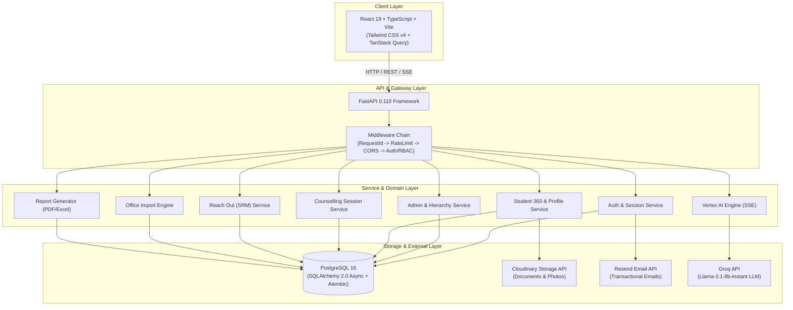
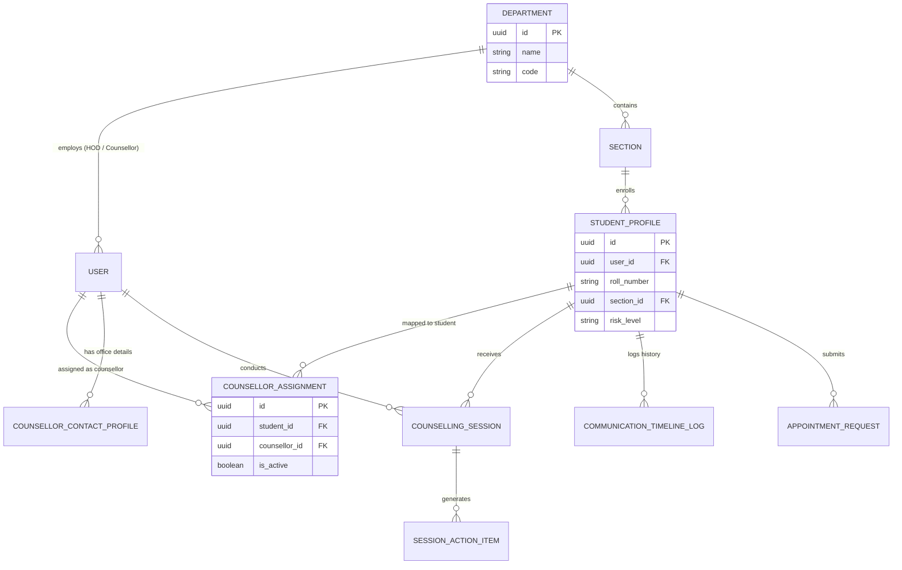

# System Architecture & Technical Specifications

This document details the architectural design, clean architecture layers, domain topologies, request lifecycles, and component interactions of the Student Counselling Management System (SCMS) Enterprise Platform.

---

## 1. System Topology & Monorepo Overview

SCMS is built as a workspace-oriented monorepo utilizing Clean Architecture and Domain-Driven Design (DDD) principles.



---

## 2. Clean Architecture Layers

SCMS enforces strict layer boundary separation across all domain feature modules (`app/features/`):

```
┌────────────────────────────────────────────────────────┐
│ Router Layer (FastAPI Routers & OpenAPI Schemas)      │
└───────────────────────────┬────────────────────────────┘
                            │ Dependencies (DB Session, User, Permissions)
                            ▼
┌────────────────────────────────────────────────────────┐
│ Service Layer (Business Logic & Audit Logging)         │
└───────────────────────────┬────────────────────────────┘
                            │ Domain Entities & Query Operations
                            ▼
┌────────────────────────────────────────────────────────┐
│ Repository Layer (SQLAlchemy 2.0 Async Queries)        │
└───────────────────────────┬────────────────────────────┘
                            │ Connection Pool & AsyncPG Driver
                            ▼
┌────────────────────────────────────────────────────────┐
│ Database Layer (PostgreSQL 16 Engine)                  │
└────────────────────────────────────────────────────────┘
```

1. **Router Layer (`router.py`)**: Declares API endpoints, dependency injection (`get_async_db`, `get_current_active_user`, `require_permission`), Pydantic schema validation, and HTTP response envelope formatting.
2. **Service Layer (`service.py`)**: Implements core business logic, domain rules, state machine transitions, permission checks, audit logging invocation, and multi-repository transaction management.
3. **Repository Layer (`repository.py`)**: Handles data persistence using SQLAlchemy 2.0 async queries (`select`, `insert`, `update`).
4. **Model Layer (`models.py`)**: Defines database table entities inheriting from SQLAlchemy `Base` and standard mixins (`TimestampMixin`, `SoftDeleteMixin`, `AuditMixin`).
5. **Schema Layer (`schemas.py`)**: Contains Pydantic v2 schemas for request body validation, response serialization, and DTO types.

---

## 3. Reach Out (SRM) Topology

The Reach Out (Student Relationship Management) domain manages multi-counsellor department topology and caseload routing:



- **Department Topology**: `departments` table maps academic departments.
- **Multiple Counsellors per Department**: Users with `COUNSELLOR` role assigned to a `department_id`.
- **Dynamic Scope Resolution**:
  - **Student View**: Looked up via active `CounsellorAssignment`. If unassigned, returns `assigned: false` (`"No counsellor has been assigned yet."`).
  - **Counsellor View**: Restricted strictly to assigned student caseload.
  - **HOD View**: Supervised access to all counsellors and caseloads within their department.
  - **Admin View**: Configuration access across all departments.

---

## 4. Inbound Request Lifecycle & Middleware Pipeline

```
[ Inbound Request ]
       │
       ▼
1. RequestIdMiddleware         --> Assigns/propagates X-Request-ID header
       │
       ▼
2. RateLimitMiddleware        --> Enforces per-IP / per-token rate limits
       │
       ▼
3. CORSMiddleware              --> Validates origins against BACKEND_CORS_ORIGINS
       │
       ▼
4. Router Dependency Injection --> Resolves DB session (get_async_db) & User token
       │
       ▼
5. Password Change Gate        --> Rejects non-change endpoints if force_password_change=True (HTTP 403)
       │
       ▼
6. RBAC Permission Check       --> Verifies require_permission("...") against user's roles fresh from DB
       │
       ▼
7. Pydantic Request Validation --> Validates payload against Pydantic schema (HTTP 422 on failure)
       │
       ▼
8. Service & Business Logic    --> Executes domain operations, records audit logs, commits DB transaction
       │
       ▼
[ Outbound Response ]          --> Returns standard JSON / Stream payload
```

---

## 5. Architectural Principles & Patterns

1. **Workspace-Oriented Mental Model**: User experience revolves around role-specific workspaces (Student 360 Workspace, Counsellor Workspace, HOD Workspace, Admin Desk, Faculty Portal).
2. **Actionable Dashboards**: Every dashboard presents Attention Required → Today's Tasks → Recent Activity → Quick Actions → Insights.
3. **Session Immutability**: Counselling session observations are append-only. Once logged, observations cannot be altered or deleted, ensuring an audit trail.
4. **Soft Delete & Auditability**: All business entities utilize `deleted_at` soft-delete flags. Auditability fields (`created_by`, `updated_by`, `version`) are present on core models.
5. **Zero-Mock Policy**: All screens and statistics are backed by real database queries (`SQLAlchemy 2.0` async ORM over `asyncpg`). Where data does not exist, the UI explicitly displays `has_data: false` or `"Insufficient data."` instead of generating fabricated metrics.
6. **In-Process Domain Event Bus**: `app/core/events.py` provides an in-process pub/sub `EventBus` used to trigger async notifications and timeline events across modules.
