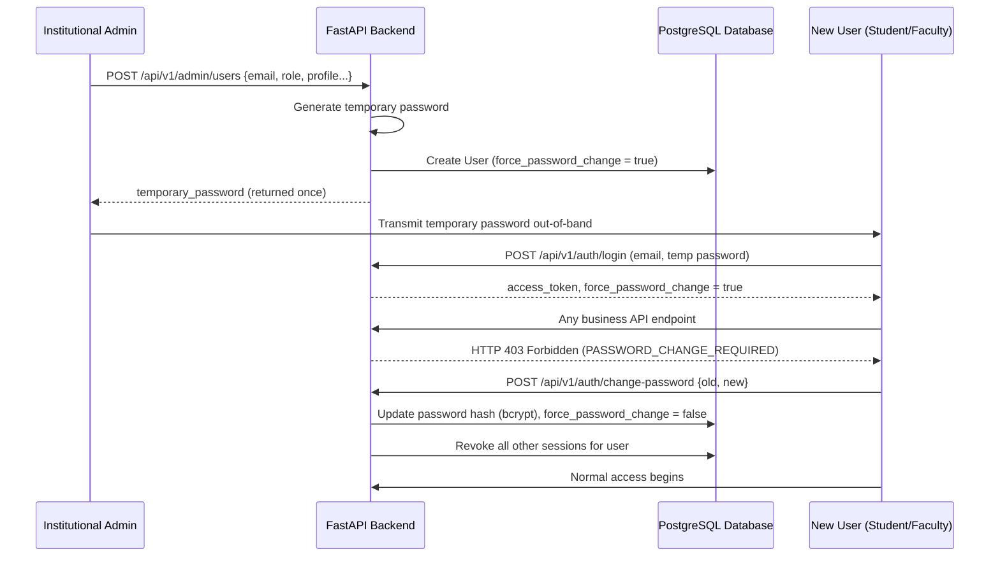

# Authentication & User Management Specifications

SCMS is a closed institutional platform. There is no self-registration, no "Create Account" button, and no public sign-up API. All user accounts are provisioned by an Administrator.

---

## 1. User Hierarchy

```
Super Admin (Platform System Level)
      │
    Admin (Institutional Administrator)
      │
     HOD (Head of Department)
      │
  Counsellor (Mentorship Staff)
      │
    Faculty (Teaching Staff)
      │
    Student (Enrolled Student)
```

Only **Admin** (and Super Admin) can create users, and only for roles below Admin in the hierarchy (`HOD`, `COUNSELLOR`, `FACULTY`, `STUDENT`).

---

## 2. Account Creation & First Login Flow



The `PASSWORD_CHANGE_REQUIRED` gate is enforced **server-side** on every business endpoint (via the `get_current_active_user` dependency). Hitting the API directly cannot bypass it.

---

## 3. Login, Session & Refresh Token Rotation

- **Access Token**: Short-lived JWT (15 min default), held in memory on the client only (never written to `localStorage` or `sessionStorage`), sent as `Authorization: Bearer <token>`.
- **Refresh Token**: Opaque token (`<id>.<secret>`), delivered as an `HttpOnly`, `SameSite=Lax` cookie. Only a SHA-256 hash of the secret is stored server-side (`refresh_tokens` table) — a stolen database row cannot forge a session.
- **Rotation & Reuse Detection**: Every `POST /api/v1/auth/refresh` call issues a new refresh token in the same rotation *family* (`family_id`) and marks the old one used. Presenting an already-used or revoked token triggers theft detection — the entire token family is revoked immediately, forcing re-authentication.
- **Remember Me**: Unchecked → session cookie expires in 1 day (`REFRESH_TOKEN_EXPIRE_DAYS`); checked → 30 days (`REMEMBER_ME_REFRESH_TOKEN_EXPIRE_DAYS`).
- **Logout**: Revokes the token family server-side and clears the cookie. Client clears in-memory token, TanStack query cache, and session state.

---

## 4. Authorization & RBAC Permission Matrix

Permissions are granular strings (`user.manage`, `counselling.create`, `student.read`, etc.) attached to roles:

| Permission String | Description | Admin | HOD | Counsellor | Faculty | Student |
| :--- | :--- | :---: | :---: | :---: | :---: | :---: |
| `user.manage` | Create, update, deactivate users & sessions | ✅ | ❌ | ❌ | ❌ | ❌ |
| `department.manage` | Configure departments & sections | ✅ | ❌ | ❌ | ❌ | ❌ |
| `academic.manage` | Manage academic years & subjects | ✅ | ❌ | ❌ | ❌ | ❌ |
| `student.read` | View student 360 profiles | ✅ | ✅ | ✅ | ❌ | ✅ (Self) |
| `student.caseload.read`| View caseload roster | ✅ | ✅ | ✅ | ❌ | ❌ |
| `student.risk.manage` | Update student risk flags | ✅ | ✅ | ✅ | ❌ | ❌ |
| `counselling.create` | Record new counselling session | ✅ | ✅ | ✅ | ❌ | ❌ |
| `counselling.read` | View counselling session notes | ✅ | ✅ | ✅ | ❌ | ❌ |
| `counselling.update` | Update follow-up action items | ✅ | ✅ | ✅ | ❌ | ❌ |
| `counselling.acknowledge`| Acknowledge session summary | ❌ | ❌ | ❌ | ❌ | ✅ |
| `attendance.create` | Record bulk class attendance | ✅ | ✅ | ❌ | ✅ | ❌ |
| `attendance.read` | View attendance metrics | ✅ | ✅ | ✅ | ✅ | ✅ (Self) |
| `attendance.correction.create`| Request attendance correction | ❌ | ❌ | ❌ | ❌ | ✅ |
| `attendance.correction.approve`| Approve attendance correction | ✅ | ✅ | ❌ | ✅ | ❌ |
| `marks.create` | Enter student examination marks | ✅ | ✅ | ❌ | ✅ | ❌ |
| `academics.read` | View academic records & SGPA | ✅ | ✅ | ✅ | ✅ | ✅ (Self) |
| `parent_communication.create`| Log parent interactions | ✅ | ✅ | ✅ | ❌ | ❌ |
| `parent_communication.read`| View parent interaction history | ✅ | ✅ | ✅ | ❌ | ❌ |
| `report.generate` | Generate institutional reports | ✅ | ✅ | ✅ | ❌ | ❌ |
| `report.download` | Download generated report files | ✅ | ✅ | ✅ | ❌ | ✅ (Self) |
| `audit.read` | View administrative audit logs | ✅ | ❌ | ❌ | ❌ | ❌ |
| `settings.manage` | Modify system settings | ✅ | ❌ | ❌ | ❌ | ❌ |
| `profile.self.manage` | Edit personal self-service profile | ❌ | ❌ | ❌ | ❌ | ✅ |

---

## 5. Bootstrapping the First Admin

Because self-registration does not exist, an environment with no users has no way to create its first account through the UI. Run the idempotent seed script once per environment:

```bash
cd apps/backend
python -m app.scripts.seed
```

This seeds all roles/permissions and creates one Admin account from `INITIAL_ADMIN_EMAIL` / `INITIAL_ADMIN_PASSWORD` (configured in `.env`), with `force_password_change = true`, so the first login is forced through the change-password flow.
